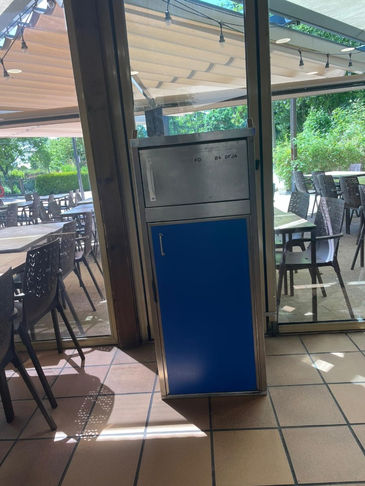
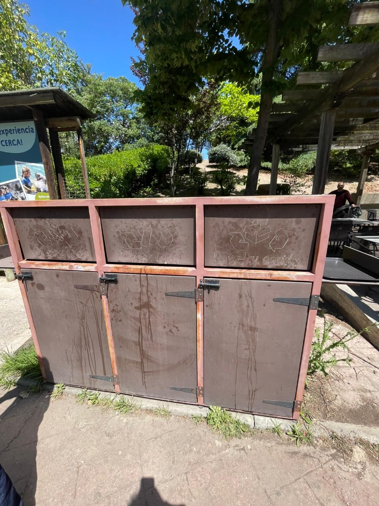
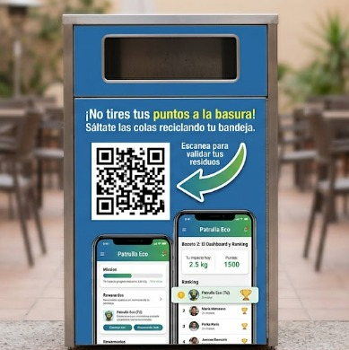
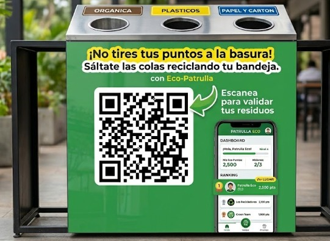
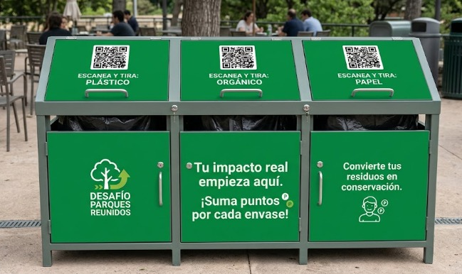
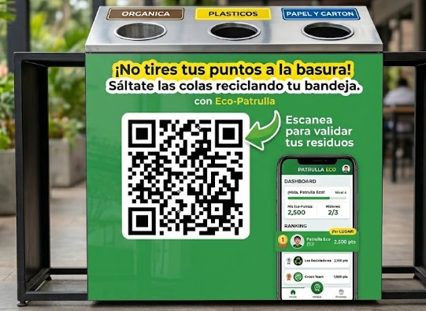

# Memoria del Trabajo Final: EcoScanner Adventures

**Asignatura:** [Nombre de la asignatura]  
**Curso:** [Curso académico]  
**Autores:** [Nombres de los integrantes del equipo]  
**Fecha:** Mayo 2026

---

## Índice

1. [Introducción](#1-introducción)
2. [Objetivos](#2-objetivos)
3. [Metodología: Design Thinking](#3-metodología-design-thinking)
   - 3.1. [Fase 1 — Empatizar](#31-fase-1--empatizar)
   - 3.2. [Fase 2 — Definir](#32-fase-2--definir)
   - 3.3. [Fase 3 — Idear](#33-fase-3--idear)
   - 3.4. [Fase 4 — Prototipar](#34-fase-4--prototipar)
   - 3.5. [Fase 5 — Evaluar (Testear)](#35-fase-5--evaluar-testear)
4. [Resultados](#4-resultados)
5. [Conclusiones](#5-conclusiones)
6. [Bibliografía](#6-bibliografía)
7. [Anexos](#7-anexos)

---

## 1. Introducción

El presente trabajo se enmarca en el reto de sostenibilidad propuesto por Parques Reunidos bajo el lema **"Juega, Come, Impacta"**, con el objetivo de diseñar una solución digital que fomente el reciclaje activo entre los visitantes de parques temáticos, concretamente en **Faunia** (Madrid).

Los parques temáticos y zoológicos son espacios dedicados al ocio, la educación ambiental y la conservación. Sin embargo, las zonas de restauración y descanso generan un volumen significativo de residuos (vasos, platos de cartón, envases plásticos) que, a pesar de la presencia de contenedores de reciclaje, a menudo no se separan correctamente. Las soluciones pasivas tradicionales —señalética, cubos de colores, paneles informativos— resultan insuficientes para captar la atención de un visitante hiperestimulado por el entorno del parque y centrado en disfrutar de su tiempo de ocio.

Ante esta realidad, nuestro equipo ha desarrollado **EcoScanner Adventures**, una aplicación web progresiva (sin necesidad de descarga) que aplica principios de **gamificación** y **diseño de comportamiento** para transformar el acto de reciclar en una experiencia lúdica integrada en la propia visita al parque. La aplicación convierte a Faunia en un tablero de aventuras donde el reciclaje es la mecánica principal del juego, no un complemento.

Este documento recoge todo el proceso de diseño siguiendo la metodología **Design Thinking**, desde la investigación de campo inicial hasta la evaluación del prototipo con usuarios reales.

---

## 2. Objetivos

### 2.1. Objetivo General

Diseñar y prototipar una solución digital basada en gamificación que incremente la tasa de reciclaje correcto entre los visitantes de Faunia, transformando un comportamiento percibido como "obligación" en una experiencia voluntaria y gratificante.

### 2.2. Objetivos Específicos

1. **Comprender el comportamiento real** del visitante de Faunia en relación con la gestión de residuos durante su visita, mediante observación directa en el parque.
2. **Identificar las barreras motivacionales** (intrínsecas y extrínsecas) que impiden al visitante reciclar correctamente en un contexto de ocio.
3. **Diseñar una experiencia gamificada** que utilice mecánicas de juego probadas (coleccionismo, progresión, recompensas, narrativa) para incentivar el reciclaje activo.
4. **Prototipar una aplicación web funcional** que sea accesible sin descarga ni registro, reduciendo al máximo la fricción de adopción.
5. **Proponer un rediseño del entorno físico** (contenedores y cartelería) que conecte el espacio físico del parque con la experiencia digital.
6. **Evaluar la usabilidad del prototipo** mediante pruebas con usuarios utilizando el protocolo *Thinking Aloud*.

---

## 3. Metodología: Design Thinking

La metodología empleada en este proyecto es **Design Thinking** (Brown, 2008), un enfoque de innovación centrado en el usuario que estructura el proceso creativo en cinco fases iterativas: Empatizar, Definir, Idear, Prototipar y Evaluar. A continuación se detalla el trabajo realizado en cada una de ellas.

### 3.1. Fase 1 — Empatizar

#### 3.1.1. Visita de campo a Faunia

Durante nuestra visita a Faunia, pudimos sumergirnos en la increíble diversidad de los ecosistemas recreados, desde el frío extremo del Ecosistema de los Polos hasta la inmersiva humedad de La Jungla Amazónica. Esta experiencia nos permitió observar no solo la belleza y vulnerabilidad de las especies que habitan el parque, sino también **la dinámica de los visitantes**.

Notamos que, aunque Faunia hace un excelente trabajo de concienciación a través de paneles y charlas educativas, en los momentos de mayor afluencia y distracción —especialmente en las zonas de *Food & Beverage* y áreas de descanso— la conciencia ambiental a veces pasa a un segundo plano. Observamos el volumen de residuos generados (vasos, platos de cartón, plásticos) y confirmamos que las papeleras de reciclaje, aunque presentes, a menudo no se utilizan correctamente porque el visitante está priorizando el ocio y la comodidad.

#### 3.1.2. Evidencia fotográfica de la visita

Durante la visita de campo se realizó un registro fotográfico de la infraestructura de reciclaje existente en el parque. Estas imágenes fueron tomadas por el equipo y sirvieron como base para el posterior análisis y propuesta de rediseño:

**Papelera individual en zona de restauración:**

**Contenedores de reciclaje múltiples (orgánico, plásticos, papel y cartón):**

Como se puede observar, los contenedores presentan un aspecto genérico y deteriorado: colores apagados, señalética apenas legible, ausencia total de elementos interactivos y, en el caso de los contenedores triples, signos visibles de oxidación. Nada en su apariencia invita al visitante a detenerse ni genera una conexión con la experiencia del parque.

#### 3.1.3. Hallazgos clave de la observación

| Hallazgo | Detalle |
|---|---|
| **Desconexión mensaje-acción** | El mensaje educativo del parque no se traduce en acciones concretas del visitante en las zonas de restauración. |
| **Hiperestimulación** | Los visitantes están saturados de estímulos (atracciones, animales, espectáculos), lo que reduce su capacidad de atención hacia la señalética de reciclaje. |
| **Priorización del ocio** | Reciclar se percibe como una interrupción del tiempo de diversión, no como parte de la experiencia. |
| **Infraestructura insuficiente** | Aunque hay contenedores de reciclaje, su diseño pasa desapercibido y las instrucciones no resultan atractivas. |
| **Público familiar** | El público principal son familias con niños, un segmento con alta receptividad hacia experiencias gamificadas. |

Esto evidenció una **desconexión entre el mensaje del parque y las acciones impulsivas del visitante** durante su tiempo de descanso.

---

### 3.2. Fase 2 — Definir

#### 3.2.1. Comprensión del reto

El reto lanzado por Parques Reunidos ("Juega, Come, Impacta") nos plantea una realidad clara: las soluciones pasivas y tradicionales ya no son suficientes. Los carteles informativos o los cubos de colores no logran captar la atención de un visitante que está hiperestimulado por el entorno del parque.

Entendimos que el reto nos pedía un **cambio de paradigma**: en lugar de exigirle al visitante que haga un "esfuerzo" por reciclar, debemos ofrecerle un incentivo interactivo y atractivo. Nos pedían diseñar una estrategia digital y de gamificación capaz de convertir el acto de tirar la basura en una experiencia **tan gratificante y divertida como cualquier otra atracción del parque**.

#### 3.2.2. Definición del problema

El problema central a resolver es la **falta de motivación intrínseca y extrínseca** del visitante para reciclar correctamente durante su tiempo de ocio.

La gente acude a los parques temáticos para escapar de sus rutinas y obligaciones. Reciclar adecuadamente se percibe habitualmente como una "tarea" o una obligación moral que interrumpe la diversión. El problema, por tanto, es de **diseño de comportamiento**:

> *¿Cómo integramos el acto de separar y tirar residuos de forma que se perciba como parte de la diversión (el juego) y no como una interrupción de la misma?*

#### 3.2.3. Perfil del usuario objetivo

- **Primario:** Familias con niños (6-14 años) visitando el parque.
- **Secundario:** Adolescentes y jóvenes adultos (15-30 años) familiarizados con mecánicas de videojuegos.
- **Necesidad:** Diversión sin interrupciones + sentir que contribuyen a algo positivo.
- **Frustración:** Sentir que reciclar es aburrido, confuso o irrelevante durante su día de ocio.

---

### 3.3. Fase 3 — Idear

#### 3.3.1. Principio de diseño: *Game-First*

Tras múltiples sesiones de brainstorming, el equipo convergió en un principio fundamental: **no diseñar una "app de reciclaje con juegos", sino un "juego de aventuras donde reciclar es la mecánica principal"**. Este giro conceptual (*Game-First*) es la base de toda la solución.

#### 3.3.2. La solución: EcoScanner Adventures

**EcoScanner Adventures** es una aplicación web progresiva (sin necesidad de descargas ni registros) que transforma la visita a Faunia en una aventura gamificada. Sus pilares son:

| Pilar | Descripción |
|---|---|
| **🗺️ Aventura y Exploración** | El mapa de Faunia se convierte en un tablero de juego interactivo con misiones, pistas y misterios por resolver en las diferentes zonas del parque. |
| **🐾 Colección de Criaturas** | Los usuarios descubren criaturas virtuales asociadas a los ecosistemas reales del parque (Bosque, Océano, Fuego, Cristal). Estas criaturas evolucionan y suben de nivel. |
| **📱 Mecánica Central (Escaneo)** | Para evolucionar a las criaturas y avanzar en la aventura, el usuario necesita "Eco-Puntos". La forma principal de conseguirlos es **escaneando los códigos QR de los contenedores al reciclar sus residuos correctamente**, o participando en los minijuegos educativos "Anti-Filas". |
| **🎁 Recompensas Reales** | Los Eco-Puntos funcionan como moneda virtual canjeable por recompensas tangibles dentro del grupo Parques Reunidos: palomitas gratis, refrescos, Fast Passes, o incluso entradas con descuento para otros parques como Parque Warner o Parque de Atracciones. |
| **👥 Componente Social** | Sistema de rankings, patrullas ecológicas (equipos), y desafíos colaborativos que fomentan la competición sana y el sentido de comunidad. |

#### 3.3.3. Arquitectura de pantallas

La aplicación se estructura en las siguientes secciones principales:

| Pantalla | Función |
|---|---|
| **Onboarding** | Bienvenida, elección de avatar y nombre de aventurero. Cero fricción (sin registro de cuenta). |
| **Inicio** | Dashboard principal con capítulo actual de la aventura, preview de criaturas, ranking y acceso al escáner. |
| **Mapa** | Mapa interactivo de Faunia con pines de quests, criaturas y misterios. |
| **Escáner** | Cámara para escanear los QR de los contenedores. Incluye simulación de análisis IA del material. |
| **Criaturas** | Colección completa de criaturas descubiertas y por descubrir (siluetas con efecto shimmer). |
| **Premios (Marketplace)** | Catálogo de recompensas canjeables por Eco-Puntos. |
| **Patrulla** | Sección social con equipo, ranking de patrulla y misiones grupales. |
| **Perfil** | Estadísticas del usuario, logros, historial de puntos y rachas. |
| **Trivia** | Minijuegos de preguntas sobre medio ambiente ("Anti-Filas"). |
| **Misión Diaria** | Reto diario con recompensas extra para fomentar el retorno. |

#### 3.3.4. Mecánicas de gamificación empleadas

| Mecánica | Implementación | Motivación que activa |
|---|---|---|
| **Puntos (Eco-Puntos)** | Se obtienen al escanear, jugar trivias y completar misiones | Progresión y recompensa inmediata |
| **Coleccionismo** | Sistema de criaturas por descubrir con siluetas ocultas | Curiosidad y completismo |
| **Evolución** | Las criaturas evolucionan con alimentación (puntos) | Compromiso a largo plazo |
| **Narrativa** | Aventura por capítulos con pistas y acertijos | Inmersión y propósito |
| **Rachas** | Contador de días consecutivos reciclando | Hábito y consistencia |
| **Rankings** | Clasificación entre usuarios y patrullas | Competición social |
| **Recompensas tangibles** | Canje de puntos por premios reales | Motivación extrínseca directa |
| **Misiones diarias** | Retos renovados cada día | Retorno recurrente |

---

### 3.4. Fase 4 — Prototipar

#### 3.4.1. Decisiones técnicas

| Decisión | Justificación |
|---|---|
| **Aplicación Web (no nativa)** | Accesible desde cualquier navegador sin descarga. Reduce la fricción de adopción a cero: basta escanear un QR para empezar a jugar. |
| **Sin registro obligatorio** | El onboarding solo pide un nombre y un avatar. Se almacena en `localStorage`. El objetivo es que el visitante empiece a jugar en menos de 30 segundos. |
| **HTML + CSS + JavaScript Vanilla** | Stack ligero, sin dependencias de frameworks, para máxima velocidad de carga en la red móvil del parque. |
| **Diseño *Mobile-First*** | El 100% de los visitantes usarán la app en su smartphone. Diseño optimizado para pantallas de 375-430px. |
| **Tipografía Nunito** | Fuente redondeada y amigable, coherente con la estética lúdica y familiar del parque. |

#### 3.4.2. Prototipo funcional

Se desarrolló un **prototipo de alta fidelidad completamente interactivo** compuesto por los siguientes archivos:

- **10 páginas HTML** con navegación funcional entre ellas.
- **Sistema de estilos modular** (main.css, components.css, animations.css) con variables CSS para consistencia visual.
- **Motor de estado en JavaScript** (app.js) que gestiona puntos, criaturas, aventuras, rankings y persistencia en localStorage.
- **Animaciones y microinteracciones** (confetti al canjear, criaturas flotantes, shimmer en siluetas, transiciones de página) para crear una experiencia premium.

El prototipo simula el flujo completo del usuario: desde el onboarding hasta el canje de recompensas, pasando por la exploración del mapa, el escaneo de QR (simulado), la evolución de criaturas y la participación en trivias.

#### 3.4.3. Propuesta de rediseño del entorno físico (Generación con IA)

Como parte complementaria e innovadora de la solución digital, hemos elaborado una **propuesta visual de rediseño de los elementos físicos del parque** (contenedores y cartelería). Para ello, utilizamos las **fotografías reales tomadas durante la visita de campo a Faunia** (documentadas en la sección 3.1.2) como base, y las procesamos mediante **herramientas de generación de imágenes con Inteligencia Artificial** para crear mockups realistas de cómo lucirían los contenedores y puntos de reciclaje tras la implementación de EcoScanner Adventures.

**Proceso de creación:**

1. **Fotografía in situ:** Se tomaron fotografías de los contenedores y papeleras reales del parque durante la visita de campo.
2. **Diseño del concepto:** Se definieron los elementos a integrar: branding de EcoScanner/Eco-Patrulla, códigos QR funcionales, mensajes de gamificación ("¡No tires tus puntos a la basura!", "Suma puntos por cada envase") y visualizaciones de la propia app.
3. **Generación con IA:** Utilizando herramientas de edición y generación de imágenes por IA, se aplicaron los diseños sobre las fotografías originales, manteniendo el contexto real del parque (iluminación, perspectiva, entorno) para lograr un resultado visualmente convincente y realista.

El objetivo es cerrar la brecha entre el espacio físico y la experiencia digital, convirtiendo cada punto de reciclaje en un **punto de interacción gamificado** que invita al visitante a participar.

---

##### Papeleras de Reciclaje Individuales (Antes vs. Después)

A continuación, se observa el estado actual de las papeleras de reciclaje y nuestra propuesta de rediseño, donde se integran instrucciones claras, el branding de la aplicación y el código QR de acceso rápido a EcoScanner.

**Antes (Fotografía real tomada en Faunia):**

**Después (Mockups generados con IA):**

La papelera pasa de ser un elemento invisible y genérico a un **punto de contacto interactivo** con mensajes como *"¡No tires tus puntos a la basura! Sáltate las colas reciclando tu bandeja"* y una visualización de las pantallas de la app que genera curiosidad.

---

##### Contenedores de Reciclaje Múltiples (Antes vs. Después)

De igual manera, los contenedores de separación de residuos (orgánico, plásticos, papel y cartón), que actualmente presentan un aspecto deteriorado y oxidado, se transforman en paneles interactivos que incitan a la participación:

**Antes (Fotografía real tomada en Faunia):**

**Después (Mockups generados con IA):**

El contraste entre el estado original (contenedores oxidados, sin color, sin indicaciones claras) y las propuestas rediseñadas es especialmente llamativo. Las nuevas versiones incorporan:
- **Códigos QR individuales** por tipo de residuo (plástico, orgánico, papel).
- **Mensajes de gamificación** que conectan el acto de reciclar con la mecánica de la app ("Suma puntos por cada envase").
- **Visualizaciones de la app** que muestran el dashboard y el ranking, generando curiosidad e invitando a escanear.
- **Branding coherente** con la identidad visual de EcoScanner Adventures y Parques Reunidos.

---

Este rediseño visual demuestra que, al aplicar la gamificación desde el primer impacto visual en el entorno físico, se puede **transformar un contenedor ignorado en una atracción más del parque**, aumentando significativamente las posibilidades de participación activa de los visitantes. La combinación de fotografía real + generación con IA nos ha permitido crear una propuesta visual convincente sin necesidad de fabricar prototipos físicos.

---

### 3.5. Fase 5 — Evaluar (Testear)

#### 3.5.1. Metodología de evaluación

Para evaluar la usabilidad y la experiencia de usuario del prototipo, se diseñó un **protocolo de evaluación basado en la técnica *Thinking Aloud*** (Nielsen, 1993). En esta técnica, el usuario verbaliza continuamente lo que piensa, siente y observa mientras interactúa con la aplicación, lo que permite al evaluador identificar puntos de fricción, confusión y satisfacción.

#### 3.5.2. Protocolo de pruebas

Se definieron las siguientes tareas representativas del flujo principal de la aplicación:

| Tarea | Escenario presentado al usuario | Acción esperada |
|---|---|---|
| **T1: Descubrimiento** | "Acabas de llegar a Faunia y abres la web. ¿Qué crees que hace?" | Explorar la pantalla de inicio y comprender la propuesta de valor. |
| **T2: Iniciar aventura** | "Quieres empezar a jugar. ¿Cómo lo harías?" | Pulsar "Empezar Aventura" o navegar por el menú inferior. |
| **T3: Uso del mapa** | "Necesitas saber si hay algo especial cerca. ¿Dónde buscas?" | Navegar al mapa e interactuar con los pines. |
| **T4: Escaneo de reciclaje** | "Has terminado de comer y quieres reciclar para ganar puntos." | Encontrar y usar el Escáner para simular un escaneo. |
| **T5: Canje de recompensas** | "Tienes puntos y quieres ver si puedes conseguir un premio." | Navegar a Premios y completar un canje. |

#### 3.5.3. Resultados de la evaluación

[Incluir aquí los resultados obtenidos de las pruebas con usuarios: hallazgos principales, citas textuales relevantes de los participantes, y problemas de usabilidad identificados.]

#### 3.5.4. Iteraciones realizadas

A partir del feedback recibido, se realizaron las siguientes mejoras en el prototipo:

- [Listar las mejoras implementadas tras las pruebas de usuario, por ejemplo: ajustes de navegación, cambios en la jerarquía visual, corrección de z-index en modales, etc.]

---

## 4. Resultados

### 4.1. Prototipo funcional entregado

Se ha desarrollado un prototipo de alta fidelidad completamente navegable que demuestra la viabilidad de la solución propuesta. El prototipo incluye:

- **10 pantallas interconectadas** con navegación completa.
- **Motor de estado JavaScript** con persistencia en localStorage que simula el progreso real del usuario.
- **4 tipos de criaturas** con sistema de evolución de 3 etapas.
- **Aventura narrativa** con 5 capítulos jugables de diferentes tipos (escaneo, exploración, trivia, social).
- **Sistema de rankings** con 10 jugadores simulados y posicionamiento dinámico del usuario.
- **Marketplace de recompensas** con 4 premios canjeables y confirmación visual con animación de confetti.
- **Propuesta visual de rediseño** de contenedores y cartelería del parque.

### 4.2. Alineación con el reto "Juega, Come, Impacta"

| Componente del reto | Cómo lo aborda EcoScanner |
|---|---|
| **Juega** | La aventura, las criaturas, las trivias y las misiones diarias convierten la visita en un juego continuo. |
| **Come** | La mecánica de escaneo se activa precisamente en las zonas de restauración, donde se generan los residuos. Los QR están en bandejas y contenedores. |
| **Impacta** | Cada acción de reciclaje se traduce en puntos que alimentan criaturas, desbloquean capítulos y generan recompensas reales, creando un círculo virtuoso de impacto positivo. |

### 4.3. Viabilidad técnica

La solución se ha diseñado intencionadamente como **aplicación web** (no nativa) por las siguientes ventajas operativas:

- **Cero fricción de adopción:** El visitante escanea un QR con su cámara y empieza a jugar en el navegador, sin pasar por tiendas de apps.
- **Mantenimiento centralizado:** Las actualizaciones se despliegan instantáneamente sin depender de aprobaciones de App Store/Play Store.
- **Coste de desarrollo reducido:** Un único código base funciona en iOS y Android.
- **Escalabilidad:** Replicable en otros parques del grupo Parques Reunidos (Parque Warner, Parque de Atracciones, Aquópolis) cambiando únicamente los mapas, las criaturas temáticas y los contenidos narrativos.

---

## 5. Conclusiones

### 5.1. Grado de resolución del problema

Consideramos que nuestro trabajo soluciona el problema de manera **parcial, con potencial de ser una solución total tras su despliegue físico**.

**Por qué sí lo soluciona (a nivel de diseño y software):**

Soluciona totalmente la **barrera de la motivación**. Al utilizar mecánicas probadas de videojuegos (coleccionismo, evolución, rachas, recompensas inmediatas y narrativa), transformamos el esfuerzo en diversión. El público objetivo —especialmente niños, adolescentes y familias— buscará activamente reciclar para alimentar a su criatura digital, completar capítulos y subir en el ranking. Esto resuelve de raíz la apatía hacia los contenedores.

**Por qué es parcial actualmente:**

Como solución integral, el éxito no depende únicamente del software. Para que el problema se resuelva *totalmente* en la realidad del parque, este prototipo requiere una **implementación física acompañante**:

- La instalación de **códigos QR dinámicos** en las bandejas de comida y contenedores.
- Sistemas de **validación en papeleras inteligentes** (potencialmente asistidos por IA o sensores) para verificar que el usuario realmente recicla y no solo escanea.
- **Integración con los sistemas POS** del parque para automatizar el canje de recompensas.

Hasta que el circuito físico no se cierre y se pruebe la adopción masiva, la solución teórica está completa, pero su validación empírica es parcial.

### 5.2. Aprendizajes del proyecto

1. **Design Thinking como marco eficaz:** La metodología nos obligó a empezar por el usuario (observación en Faunia) antes de saltar a soluciones, lo que nos permitió identificar que el problema real no era de información (el visitante *sabe* que debe reciclar) sino de *motivación* y *diseño de comportamiento*.
2. **La gamificación no es añadir puntos:** Una gamificación superficial (solo puntos y badges) no habría funcionado. La clave fue diseñar un *juego real* con narrativa, criaturas y progresión, donde el reciclaje fuera la mecánica central, no un complemento.
3. **La accesibilidad es clave:** La decisión de usar una webapp sin registro eliminó la principal barrera de adopción en un contexto de parque temático donde el visitante no quiere perder tiempo instalando apps.

### 5.3. Líneas futuras

- **Piloto real en Faunia** con contenedores equipados con QR y sensores de validación.
- **Integración con la app oficial** de Parques Reunidos.
- **Ampliación a otros parques** del grupo con criaturas y narrativas temáticas propias.
- **Componente de Inteligencia Artificial** para la detección real de materiales mediante la cámara del dispositivo (actualmente simulada en el prototipo).
- **Análisis de datos** agregados sobre hábitos de reciclaje para optimizar la ubicación y el diseño de los contenedores.

---

## 6. Bibliografía

- Brown, T. (2008). *Design Thinking*. Harvard Business Review, 86(6), 84-92.
- Chou, Y. (2015). *Actionable Gamification: Beyond Points, Badges, and Leaderboards*. Octalysis Media.
- Deterding, S., Dixon, D., Khaled, R., & Nacke, L. (2011). From game design elements to gamefulness: Defining "gamification". *Proceedings of the 15th International Academic MindTrek Conference*, 9-15.
- Fogg, B. J. (2009). A behavior model for persuasive design. *Proceedings of the 4th International Conference on Persuasive Technology*, Article 40.
- Hamari, J., Koivisto, J., & Sarsa, H. (2014). Does gamification work? — A literature review of empirical studies on gamification. *47th Hawaii International Conference on System Sciences*, 3025-3034.
- Nielsen, J. (1993). *Usability Engineering*. Academic Press.
- Parques Reunidos. (2026). Reto de Sostenibilidad "Juega, Come, Impacta" [Briefing del reto].
- Zichermann, G., & Cunningham, C. (2011). *Gamification by Design: Implementing Game Mechanics in Web and Mobile Apps*. O'Reilly Media.

---

## 7. Anexos

### Anexo A — Guion del protocolo de evaluación *Thinking Aloud*

*(Véase el documento completo en `Guion_Evaluacion_UX.md`)*

### Anexo B — Capturas del prototipo

[Incluir aquí capturas de pantalla de las principales secciones de la aplicación: Onboarding, Inicio, Mapa, Escáner, Criaturas, Premios, Patrulla, Perfil.]

### Anexo C — Enlace al prototipo funcional

[Incluir aquí el enlace al prototipo desplegado o las instrucciones para ejecutarlo localmente.]
